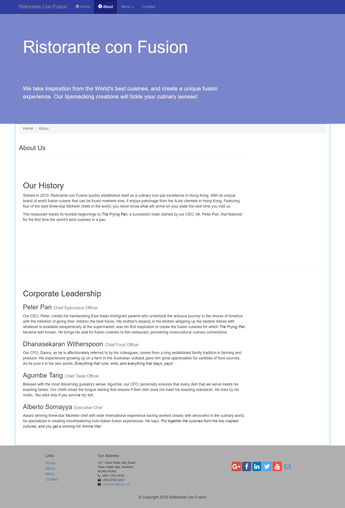
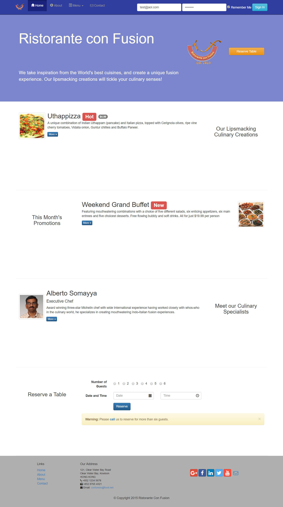

# _Front-End Web UI Frameworks and Tools_

#### _Coursera course by The Hong Kong University of Science and Technology_

#### By _Carol D. Toro_

### Description

This repository contains the series of assignments and projects completed while taking Front-End Web UI Frameworks and Tools by The Hong Kong University of Science and Technology on Coursera. This course is composed of 4 modules: Front-end Web UI Frameworks Overview, Bootstrap CSS Components, Bootstrap Javascript Components, and Web Tools.

####Week 1

####Week 2
Components explored are buttons, forms, tables, panels, wells, images, media, labels, badges, alerts and progress bars.

Assigment: 

####Week 3
This module focuses on Bootstrap's JavaScript based components like tabs, pills and tabbed naviation, collapse, accordion, scrollspy, affix, tooltips, popovers, modals, and the carousel.

Assigment:

<!-- ## Setup/Installation Requirements

* _This is a great place_
* _to list setup instructions_
* _in a simple_
* _easy-to-understand_
* _format_

_{Leave nothing to chance! You want it to be easy for potential users, employers and collaborators to run your app. Do I need to run a server? How should I set up my databases? Is there other code this app depends on?}_

## Known Bugs

_{Are there issues that have not yet been resolved that you want to let users know you know?  Outline any issues that would impact use of your application.  Share any workarounds that are in place. }_

## Support and contact details

_{Let people know what to do if they run into any issues or have questions, ideas or concerns.  Encourage them to contact you or make a contribution to the code.}_ -->

## Technologies Used

HTML, CSS, JavaScript, Bootstrap

### License

All rights reserved. Please do not use this to plagiarize assignments.

