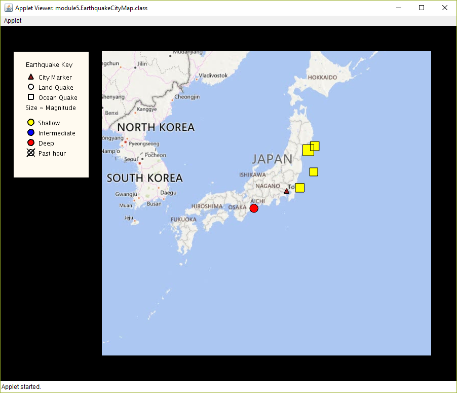
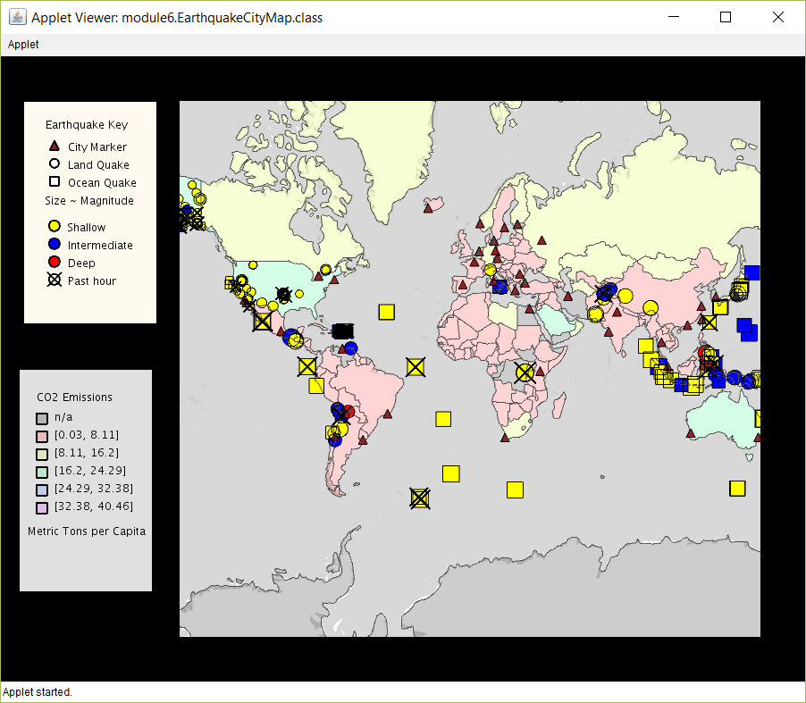
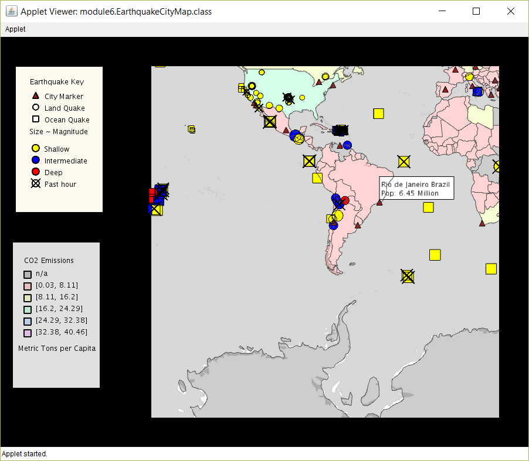
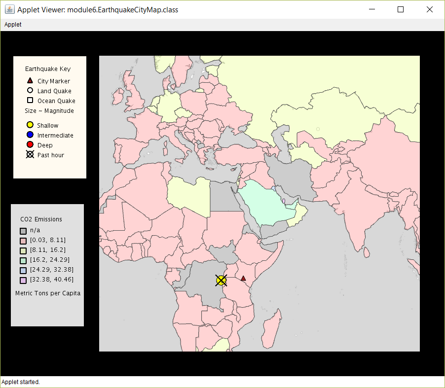

# _Object Oriented Programming in Java_

#### _Coursera course by University of California, San Diego_

#### By _Carol D. Toro_

### Description

This repository contains the series of assignments and projects completed while taking Object Oriented Programming in Java
by University of California, San Diego on Coursera. This course focuses on data visualization, building graphical user interfaces, and using core algorithms for searching and sorting data.

####module3
EarthquakeCityMap visualizes earthquake data. The program reads data from a live RSS feed and plots markers where earthquakes of magnitude 2.5 + have occurred. The style of the earthquake markers vary by severity. The program has a simple GUI with a key of markers displayed to the left of the map.

####module4
This assignment builds on the previous assignment and utilizes class hierarchies to organize and improve code. Since the impact of earthquakes depends on various factors, this program visualizes different earthquakes like earthquakes over land, in the ocean, or earthquakes that occurred in the past hour. Each type of earthquake also has an additional key for its depth. 

####module5
This assignment creates an interactive map with event handlers for hovering and clicking. When hovering over a city marker, map displays information about that city. Hovering over an earthquake results in the map displaying the title of the earthquake along with the magnitude and region it occured. Clicking on a city will lead to only displaying that city and showing only earthquakes that affect that city. Clicking again on a marker will display all of the original markers on the map. Likewise, clicking on an earthquake marker will populate on the map only the cities potentially affected by that earthquake.
<table>
	<tr>
		<td>
			
			
Hovering over city marker, displays city's name and population.

		</td>
		<td>
			
			
Selecting a city, displays earthquakes near selected city.

		</td>
	</tr>
	<tr>
		<td>
			
			
Hovering over earthquake results in display of earthquake's magnitude and name of nearest city to earthquake

		</td>
		<td>
			
			
Non-selected earthquakes are hidden and cities outside the earthquake's threat zone are also hidden.

		</td>
	</tr>
</table>
####module6
This assignment builds on the previous assignment to organize earthquake data and compute additional statistics. Earthquake Markers utilize the Comparable Interface which allows the sorting of earthquakes in reverse order of magnitude. The top highest magnitude earthquakes are printed to the console. Furthermore, each country on the map is shaded a different color to represent its value in CO2 Carbon Emmissions. 

<table>
	<tr>
		<td>
		
		
Countries shaded based on yearly CO2 Emissions

		</td>
	</tr>
	<tr>
		<td>
			
			
City details still displayed despite shading of countries.

		</td>
	</tr>
	<tr>
		<td>
			
			
Non-selected earthquakes are hidden and cities outside threat zone are also hidden.

		</td>
	</tr>
</table>
<!-- ## Setup/Installation Requirements

* _This is a great place_
* _to list setup instructions_
* _in a simple_
* _easy-to-understand_
* _format_

_{Leave nothing to chance! You want it to be easy for potential users, employers and collaborators to run your app. Do I need to run a server? How should I set up my databases? Is there other code this app depends on?}_

## Known Bugs

_{Are there issues that have not yet been resolved that you want to let users know you know?  Outline any issues that would impact use of your application.  Share any workarounds that are in place. }_

## Support and contact details

_{Let people know what to do if they run into any issues or have questions, ideas or concerns.  Encourage them to contact you or make a contribution to the code.}_ -->

## Technologies Used

Java, UnfoldingMap, Processing 

### License

All rights reserved. Please do not use this to plagiarize assignments.

